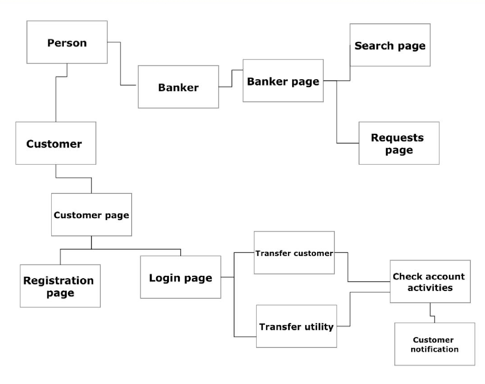

# Banking-Accounts-Management-System
Project done for the Object Oriented Programming (ECCE 230) course at Khalifa University. 

Project was done by a group of 4 students, as listed below:
- Mohammed Abdulla Al Blooshi
- **<code>Ahmed Alawi Radhi</code>**
- Sultan Hussain Alhosani
- Rashed Ammar AlKhajeh

# Objective:
The aim of this project is to build a piece of software that enhances the level of customer service provided by ABBank to each individual customer. This application complements existing Bank procedures rather than replacing them to improve user experience.

# Implementation and Class Diagram:

# Some Screenshots: 

## Login Page:

